# 🤖 Curiosity Squad – Autonomous Multi-Agent Mars Exploration

**A Multi-Agent System Simulation Using Google's Agent Development Kit (ADK)**

---

This notebook demonstrates a complete autonomous multi-agent system for Mars exploration, where robot teams must coordinate locally, explore terrain, avoid hazards, and recover teammates without human intervention.

Built with [Google Agent Development Kit (ADK)](https://google.github.io/adk-docs/agents/multi-agents/), this simulation showcases how AI agents can work together to accomplish complex missions with real-world applications.

## 📋 Table of Contents

- [🔍 1. Problem Overview](#-1-problem-overview)
- [💡 2. Concept](#-2-concept)
- [⚙️ 3. Setup](#️-3-setup)
- [🏗️ 4. Architecture](#️-4-architecture)
- [5. ADK Agent Setup](#5-adk-agent-setup)
- [✅ 6. Testing and Evaluation](#-6-testing-and-evaluation)
- [🎯 6. Conclusion](#-6-conclusion)
- [📚 Resources](#-resources)

## 🔍 1. Problem Overview

Exploring Mars involves long communication delays (up to 20 minutes one-way), making real-time control from Earth impossible. Robot teams must coordinate locally, explore terrain, avoid hazards, and recover teammates without human intervention.

**Curiosity Squad** simulates this challenge using Google's ADK.

Given a rough satellite scan (Sector), the agents must autonomously:
- Refine the map by exploring subsections
- Handle failures (broken robots, low battery, lost communication)
- Recover teammates when possible
- Return a consolidated mission report

### Real-World Applications

This pattern mirrors real-world systems such as:
- 🚁 **Coordinated drone swarms** for search and surveillance
- 🤖 **Search-and-rescue robots** operating in disaster zones
- 📦 **Warehouse automation** with multiple autonomous vehicles
- 🌊 **Underwater exploration** with autonomous submersibles


## 💡 2. Concept

A ship lands on Mars and deploys **N explorer robots**.

### System Components

- **🚀 Base Station**: Acts as command center, operated by a **CoordinatorAgent (CA)**
- **🤖 Explorer Robots**: Each robot is a **DiscoveryAgent (DA)** capable of:
  - Mapping terrain and identifying resources
  - Logging hazards and obstacles
  - Rescuing stuck or broken teammates
  - Managing battery levels autonomously

### Mission Flow

1. **Earth Command**: _"Explore Sector X and return a refined map."_
2. **Sector Division**: CA divides the sector into N subsections
3. **Assignment**: Each robot receives a subsection to explore
4. **Autonomous Execution**: Exploration and rescues run autonomously until completion
5. **Mission Report**: Consolidated findings returned to Earth

### Key points

The agents should operate **autonomously** with **peer-to-peer rescue capabilities**, simulating real conditions where Earth cannot provide real-time assistance.


## ⚙️ 3. Setup

Before we begin our evaluation journey, let's set up the environment.

### 📦 3.1: Install Dependencies

The Kaggle Notebooks environment includes a pre-installed version of the [google-adk](https://google.github.io/adk-docs/) library for Python and its required dependencies, so you don't need to install additional packages in this notebook.

To install and use ADK in your own Python development environment outside of this course, run:

```bash
%pip install --upgrade google-adk google-genai
```

### 🔑 3.2: Configure your Gemini API Key : for KAGGLE

This notebook uses the [Gemini API](https://ai.google.dev/gemini-api/), which requires an API key.

**1. Get your API key**

If you don't already have one, create an [API key in Google AI Studio](https://aistudio.google.com/app/api-keys).

**2. Add the key to Kaggle Secrets**

Next, you'll need to add your API key to your Kaggle Notebook as a Kaggle User Secret:

1. In the top menu bar of the notebook editor, select `Add-ons` then `Secrets`.
2. Create a new secret with the label `GOOGLE_API_KEY`.
3. Paste your API key into the "Value" field and click "Save".
4. Ensure that the checkbox next to `GOOGLE_API_KEY` is selected so that the secret is attached to the notebook.

**3. Authenticate in the notebook**

Run the cell below to access the `GOOGLE_API_KEY` you just saved and set it as an environment variable for the notebook to use:

```python
import os
from kaggle_secrets import UserSecretsClient

try:
    GOOGLE_API_KEY = UserSecretsClient().get_secret("GOOGLE_API_KEY")
    os.environ["GOOGLE_API_KEY"] = GOOGLE_API_KEY
    print("✅ Setup and authentication complete.")
except Exception as e:
    print(
        f"🔑 Authentication Error: Please make sure you have added 'GOOGLE_API_KEY' to your Kaggle secrets. Details: {e}"
    )

```

### 🔑 3.3: Configure your Gemini API Key : LOCAL

Create a file called `.env.local` in the project root containing this line:
```ini
GOOGLE_API_KEY=your_key_here
```

If you don't already have `python-dotenv` installed:

```bash
pip install python-dotenv
```

Then execute this cell:
```python
from dotenv import load_dotenv
load_dotenv(".env.local")
```

## 🏗️ 4. Architecture

The Curiosity Squad system uses a hierarchical multi-agent architecture with specialized agents and deterministic tools.

### Architecture Diagram

```mermaid
flowchart TD
    %% Nodes
    EUser["Earth (User)<br/>“Explore Sector X”"]
    CA["CoordinatorAgent (CA)"]

    subgraph DA_GROUP[" Discovery &nbsp;&nbsp; Agents &nbsp; &nbsp; "]
        DA1["DiscoveryAgent DA_1"]
        DA2["DiscoveryAgent DA_2"]
        DAN["DiscoveryAgent DA_N"]
    end

    ME["MissionEnvironment<br/>- Grid / sections / hazards<br/>- Mission state / activity log"]

    MS["MissionStatus LoopAgent<br/>(monitor + rescue)"]

    RA["ReportAgent<br/>(final report)"]
    EReport["Earth Mission Report"]

    %% Main flow
    EUser --> CA

    %% Balance the tree
    %% CA --> MS
    CA ~~~ MS

    CA --> DA1
    CA --> DA2
    CA --> DAN

    DA1 --> ME
    DA2 --> ME
    DAN --> ME

    ME --> MS

    %% Loop back to Coordinator
    MS --> CA

    %% Reporting path
    MS --> RA
    RA --> EReport
```

<details>
      <summary>Architecture Diagram (Click to expand)</summary>

                       +--------------------+
                       |     Earth (User)   |
                       |  "Explore Sector X"|
                       +----------+---------+
                                  |
                                  v
                       +--------------------+
                       |  CoordinatorAgent  |
                       |        (CA)        |
                       +----------+---------+
                                  |
				                  |<-----------------------------------+
                                  |                                    |
              +-------------------+-------------------+                |
              |                   |                   |                |
              v                   v                   v                |
      +---------------+   +---------------+   +----------------+       |
      | DiscoveryAgent|   | DiscoveryAgent|   | DiscoveryAgent |       |
      |     DA_1      |   |     DA_2      |   |     DA_N       |       |
      +-------+-------+   +-------+-------+   +-------+--------+       |
              ^                   ^                   ^                |
              |                   |                   |                | 
              v                   v                   v                |
      +--------------------------------------------------------+       |
      |                    MissionEnvironment                  |       |
      |                                                        |       |
      |          - Grid / sections / hazards                   |       |
      |          - Mission state & activity_log                |       |
      +---------------------------+----------------------------+       |
                                  ^                                    |
                                  |                                    |
                                  v                                    |
                      +-----------+-----------+                        |
                      |     MissionStatus     |                        |
                      |       LoopAgent       |------------------------+
                      |   (monitor + rescue)  |
                      +-----------+-----------+
                                  |
                                  v
                          +---------------+
                          |  ReportAgent  |
                          | (final report)|
                          +-------+-------+
                                  |
                                  v
                            +-----------+
                            |   Earth   |
                            | Mission   |
                            |  Report   |
                            +-----------+

</details>

### 🤖 4.1: Agents

The system consists of four types of agents:

| Agent | Role | Responsibilities |
|-------|------|------------------|
| **CoordinatorAgent (CA)** | Mission Commander | Receives mission from Earth, splits the sector, assigns subsections, oversees all stages |
| **DiscoveryAgents (DA)** | Autonomous Robots | N autonomous robots performing mapping, navigation, hazard detection, and peer rescue |
| **MissionStatus LoopAgent** | Monitor | Continuously monitors progress, triggers rescues, ensures mission flow |
| **Report Agent** | Reporter | Merges all results into the final mission summary |

### 🔧 4.2: Tools

Agents interact only through **deterministic tools** (seeded for reproducibility modulo LLM ofc):

| Tool | Purpose | Stage |
|------|---------|-------|
| `get_sections()` | Split sector into subsections and initialize mission | Stage 0 |
| `charge_battery()` | Charge a robot to full capacity | Stage 1 |
| `start_mapping()` | Deploy robot to assigned section | Stage 2 |
| `get_robot_status()` | Query current robot state and telemetry | Stage 3 |
| `rescue_robot()` | Coordinate peer-to-peer rescue operation | Stage 3 |
| `finalize_mission_report()` | Generate final mission summary | Stage 4 |
| `log_event()` | Record mission events for audit trail | All Stages |

These ensure **transparent, reproducible behavior** across mission runs.

### 📊 4.3: Mission Stages

The mission follows a structured 5-stage workflow:

1. **Stage 0 - Mission Initialization**: Receive command from Earth, parse sector ID
2. **Stage 1 - Charging**: Charge all robot batteries to full capacity
3. **Stage 2 - Deployment**: Assign sections and deploy robots
4. **Stage 3 - Exploration Loop**: Parallel exploration with continuous monitoring and rescue
5. **Stage 4 - Final Report**: Consolidate findings and generate mission report


## 5. ADK Agent Setup

Now we create the agent hierarchy:

1. **DiscoveryAgents (N robots)** - Autonomous explorer robots
2. **CoordinatorAgent** - Mission commander with DiscoveryAgents as sub-agents
3. **StatusMonitorAgent** - Monitors mission progress and coordinates rescues
4. **MissionStatusLoop** - LoopAgent wrapper for continuous monitoring
5. **MissionReportAgent** - Generates final mission report

Each agent has:
- **Model**: Gemini 2.5 Flash for good, fast, cost-effective operation
- **Tools**: Specific subset of mission tools they can invoke
- **Instructions**: Clear role definition and behavior guidelines
- **Callbacks**: LLM request/response logging for analysis

## ✅ 6. Testing and Evaluation

### 🎯 Success Criteria - measuring how well the agents performs

| Criterion | Description |
|-----------|-------------|
| **No Agent Errors** | All agents completed their tasks without crashes or unhandled exceptions |
| **Robot Accountability** | All robots reached terminal states (completed, rescued, or abandoned ... if `MAX_LOOP_ITERATIONS` big enough)
| **Clear Audit Trail** | Mission logs describe each decision with context and reasoning |
| **Rescue Coordination** | When failures occurred, peer robots successfully coordinated rescues |

_**NOTE:** The evaluation should also consider the target model! ;)_


### 🧪 Testing Approach

To thoroughly test the system:

1. **Change `TARGET_SECTOR_ID`, `NUM_ROBOTS` or `MAX_LOOP_ITERATIONS`** to different values
2. Each sector ID generates different:
   - Subsection properties (hazards, resources)
   - Random event sequences (failures, completions)
3. Track success criteria across multiple runs
4. Analyze patterns in rescue coordination

### 📈 Key Metrics to Monitor ... the mission! :D

- **Completion Rate**: Percentage of robots that successfully mapped their sections
- **Rescue Success Rate**: Percentage of failed robots that were recovered
- **Iteration Count**: How many monitoring loops were needed

### Example Test Cases

```python
# Test different scenarios 
test_sectors = [1000, 2453, 7577]
test_robots = [3, 4, 5]
test_loops = [5, 7, 9]
row_missions = []

for (sector_id, n_robots, max_loop) in zip(test_sectors, test_robots, test_loops):
    # Observe differences in outcomes
    sum_mission = await run_mission(sector_id, n_robots, max_loop, USER_ID)
    row_missions.append(sum_mission)    

pd.DataFrame(row_missions)
```

---

## 🎯 6. Conclusion


### What We Built

**Curiosity Squad** demonstrates a complete multi-agent, tool-driven autonomous mission system:

✅ **Sector Assignment**: CoordinatorAgent intelligently divides exploration areas  
✅ **Autonomous Exploration**: DiscoveryAgents operate independently with minimal oversight  
✅ **Peer-to-Peer Rescue**: Robots help each other without Earth intervention  
✅ **Continuous Monitoring**: LoopAgent ensures mission progress  
✅ **Comprehensive Reporting**: Final mission report with statistics and narrative  

### Key Features

- **Deterministic Tools**: All randomness is seeded for reproducible testing
- **Complete Audit Trail**: Every decision logged with context
- **Fault Tolerance**: System handles robot failures gracefully
- **Hierarchical Agents**: Clear separation of concerns (planning vs. execution)

### Real-World Applications

This architecture can be adapted for:

- 🚁 **Drone Swarms**: Coordinated search and surveillance operations
- 🏭 **Warehouse Automation**: Multiple AGVs coordinating pick-and-place tasks
- 🌊 **Ocean Exploration**: Autonomous submersibles mapping underwater terrain
- 🏥 **Disaster Response**: Robot teams searching disaster sites
- 🛰️ **Satellite Constellations**: Coordinated observation scheduling

### ADK Advantages

Google's Agent Development Kit provided:

- **Multi-Agent Orchestration**: Easy hierarchical agent setup with sub-agents
- **Tool Integration**: Simple function-to-tool conversion
- **Session Management**: Maintained context across multiple stages
- **Event Streaming**: Real-time visibility into agent decisions
- **Callbacks**: Fine-grained logging of LLM interactions

### Next Steps

To extend this system:

1. **Add Visualization**: Plot robot positions and exploration progress
2. **Enhance Failure Modes**: Add more realistic failure conditions
3. **Resource Management**: Track sample collection and storage
4. **Communication Delays**: Simulate realistic Mars-Earth latency
5. **Learning**: Allow robots to learn from previous missions

---

### 📚 Resources

- [Google ADK Documentation](https://google.github.io/adk-docs/)
- [Gemini API](https://ai.google.dev/gemini-api/)
- [Multi-Agent Systems Overview](https://google.github.io/adk-docs/agents/multi-agents/)

---

**Thank you for exploring Curiosity Squad! 🚀🤖**